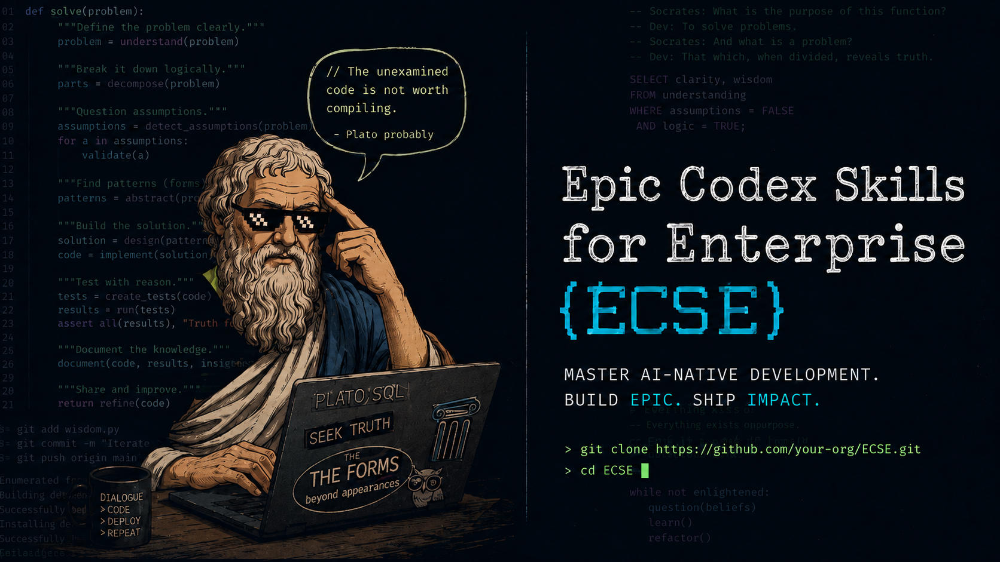

# Codex Skills for Enterprise

[](#skill-catalog)
[](https://github.com/ClarentCinematics/Codex-Skills-for-Enterprise/actions/workflows/validate-skills.yml)
[](docs/maturity-levels.md)
[](#quickstart)

<p align="center">
  
</p>

Premium, practical Codex Skills for teams that want to accelerate executive work, automate repeatable workflows, and raise the quality of day-to-day knowledge operations.

This repository is designed for enterprise AI leaders, transformation teams, and internal builders who need more than generic prompts. Each skill packages a repeatable workflow into concise instructions, reusable references, and validation standards that help Codex produce consistent, high-value work.

Codex Skills for Enterprise is Codex-first, but the workflows are plain markdown skills and can be adapted for other agentic coding assistants that support skill-like instructions, local files, or reusable workflow prompts.

## Enterprise Introduction

Codex Skills for Enterprise gives companies a practical operating layer for AI-assisted work. Instead of asking every employee to rediscover the right prompt, the organization can install shared skills for common workflows: leadership meetings, executive reporting, AI portfolio reviews, CI triage, CRM hygiene, account research, proposals, policy analysis, and knowledge capture.

The repository is intentionally conservative. Skills are not allowed to invent missing owners, dates, metrics, customer commitments, legal conclusions, or financial values. They are designed to structure evidence, surface uncertainty, and produce artifacts a human can review, improve, and use.

## At a Glance

| Area | What you get | Best for |
| --- | --- | --- |
| Executive Ops | Decision-ready briefs, reports, and status narratives | Leaders, PMs, and transformation teams |
| Engineering Ops | CI triage, PR review support, and release notes | Dev teams and platform operations |
| Revenue Ops | CRM hygiene, account research, and proposal drafting | Sales, GTM, and customer success teams |
| Knowledge Ops | Research synthesis, policy analysis, and KB capture | Strategy, operations, and knowledge teams |

> Start with one skill, validate the output on a real artifact, and scale the pattern only after the quality bar is met.

## Table Of Contents

- [Enterprise Introduction](#enterprise-introduction)
- [Documentation Map](#documentation-map)
- [Featured Skills](#featured-skills)
- [Skill Catalog](#skill-catalog)
- [Install Skills](#install-skills)
- [Skill Packs](#skill-packs)
- [Proposed Company Workflows](#proposed-company-workflows)
- [Quality Bar](#quality-bar)
- [Active Maintenance](#active-maintenance)
- [Curation Policy](docs/curation-policy.md)
- [Enterprise Adoption Path](#enterprise-adoption-path)
- [Contributing](#contributing)

## Documentation Map

| Document | Use it for |
| --- | --- |
| [Enterprise Handbook](docs/enterprise-handbook.md) | Company brief, user manual, proposed workflows, and maintenance model in one file. |
| [Sample Outputs](docs/sample-outputs.md) | Fictional examples showing output shape, caveats, and must-not-invent behavior. |
| [Enterprise Adoption Guide](docs/adoption-guide.md) | Pilot-to-rollout model for introducing skills as operating standards. |
| [Skill Packs](docs/skill-packs.md) | Pack-level installation and adoption guidance. |
| [Skill Quality Standard](docs/skill-quality-standard.md) | Required structure, instruction quality, and readiness bar. |
| [Curation Policy](docs/curation-policy.md) | What belongs here, what is rejected, and what evidence is required. |
| [Changelog](CHANGELOG.md) | User-visible repository changes and maintenance history. |
| [Support](SUPPORT.md) | How to ask for help or propose skill and documentation improvements. |
| [Security Policy](SECURITY.md) | How to handle sensitive artifacts and report safety concerns. |

## Featured Skills

| Skill | Why start here |
| --- | --- |
| [`meeting-intelligence`](skills/meeting-intelligence/SKILL.md) | Turns messy meeting notes into decisions, actions, risks, and follow-ups. |
| [`ci-failure-triage`](skills/ci-failure-triage/SKILL.md) | Adds Level 3 script-assisted CI log signal extraction for engineering teams. |
| [`crm-hygiene-auditor`](skills/crm-hygiene-auditor/SKILL.md) | Finds pipeline data-quality risks without inventing missing CRM values. |
| [`knowledge-base-capture`](skills/knowledge-base-capture/SKILL.md) | Converts expert knowledge into reusable KB articles with owner and freshness checks. |

## Why This Exists

Enterprises do not need more scattered prompt snippets. They need reliable operating patterns that help teams:

- turn messy inputs into decision-ready outputs;
- standardize reporting, follow-ups, and escalation paths;
- identify automation opportunities with measurable business value;
- preserve institutional quality standards across teams;
- move from one-off AI usage to repeatable AI-enabled workflows.

Codex Skills make that possible by giving Codex targeted procedural knowledge for specific work.

## Skill Catalog

### Executive Ops

| Skill | Enterprise outcome | Use when |
| --- | --- | --- |
| [`meeting-intelligence`](skills/meeting-intelligence/SKILL.md) | Convert meetings into decisions, owners, risks, and follow-ups | Raw meeting notes, transcripts, or recap drafts need executive-ready structure |
| [`weekly-executive-report`](skills/weekly-executive-report/SKILL.md) | Create concise weekly leadership reports | Multiple team updates need to become one clear status narrative |
| [`decision-memo`](skills/decision-memo/SKILL.md) | Frame options, tradeoffs, risks, and a recommendation | A team needs a documented decision path, not just a recommendation |
| [`project-status-brief`](skills/project-status-brief/SKILL.md) | Standardize project health, blockers, milestones, and escalations | Project updates are inconsistent, scattered, or too verbose |
| [`automation-opportunity-map`](skills/automation-opportunity-map/SKILL.md) | Identify and prioritize workflows for automation | A process needs evaluation for Codex, scripts, tools, or integration automation |
| [`cao-operating-pulse`](skills/cao-operating-pulse/SKILL.md) | Turn AI operating noise into a board-ready CAO pulse with portfolio, governance, and adoption signal | A Chief AI Officer needs a leadership brief, initiative portfolio review, shadow-AI scan, or executive AI rhythm artifact |

### Engineering Ops

| Skill | Enterprise outcome | Use when |
| --- | --- | --- |
| [`ci-failure-triage`](skills/ci-failure-triage/SKILL.md) | Diagnose failed builds, tests, checks, and release-blocking automation | CI logs or pipeline summaries need root cause, owner, reproduction, and fix path |
| [`pr-review-brief`](skills/pr-review-brief/SKILL.md) | Prepare focused, risk-aware pull request reviews | PRs or merge requests need review focus, blockers, missing tests, and suggested comments |
| [`release-notes-generator`](skills/release-notes-generator/SKILL.md) | Produce audience-specific release communication | Commits, PRs, tickets, or changelog fragments need polished release notes |

### Revenue Ops

| Skill | Enterprise outcome | Use when |
| --- | --- | --- |
| [`crm-hygiene-auditor`](skills/crm-hygiene-auditor/SKILL.md) | Improve pipeline hygiene, ownership clarity, and forecast confidence | CRM records or opportunity exports need data-quality inspection |
| [`account-research-brief`](skills/account-research-brief/SKILL.md) | Turn account context into sales-ready research and outreach angles | Account notes, research, and signals need synthesis for discovery or strategy |
| [`proposal-drafting-assistant`](skills/proposal-drafting-assistant/SKILL.md) | Draft tailored, reviewable enterprise proposals | Customer needs and solution context need a proposal or SOW-style draft |

### Knowledge Ops

| Skill | Enterprise outcome | Use when |
| --- | --- | --- |
| [`research-synthesis-brief`](skills/research-synthesis-brief/SKILL.md) | Create source-grounded research and decision briefs | Multiple sources need claims, evidence, caveats, contradictions, and actions |
| [`policy-impact-analysis`](skills/policy-impact-analysis/SKILL.md) | Translate policy changes into business impact and action plans | Policies, regulations, or internal guidance need gap analysis and rollout guidance |
| [`knowledge-base-capture`](skills/knowledge-base-capture/SKILL.md) | Preserve institutional knowledge as maintainable KB articles | Meetings, support threads, SOPs, or learnings need reusable documentation |

## Install Skills

Use the commands below to inspect, preview, or install skills in a predictable way.

List every available skill and pack:

```bash
python3 scripts/install_skill.py --list
```

Install one skill into `${CODEX_HOME:-$HOME/.codex}/skills`:

```bash
python3 scripts/install_skill.py ci-failure-triage
```

Install a full pack:

```bash
python3 scripts/install_skill.py --pack engineering-ops
```

Preview an install without copying files:

```bash
python3 scripts/install_skill.py --dry-run --pack revenue-ops
```

Existing installed skills are never overwritten unless `--force` is passed.

## Skill Packs

| Pack | Focus | Install command |
| --- | --- | --- |
| `executive-ops` | leadership rhythm, decisions, reports, project status, automation intake | `python3 scripts/install_skill.py --pack executive-ops` |
| `engineering-ops` | CI triage, PR review, release communication | `python3 scripts/install_skill.py --pack engineering-ops` |
| `revenue-ops` | CRM hygiene, account research, proposals | `python3 scripts/install_skill.py --pack revenue-ops` |
| `knowledge-ops` | research, policy impact, knowledge-base capture | `python3 scripts/install_skill.py --pack knowledge-ops` |
| `all` | every skill in the repository | `python3 scripts/install_skill.py --pack all` |

See [Skill Packs](docs/skill-packs.md) for pack details and adoption guidance.

## Proposed Company Workflows

The skills can be adopted as individual tools, but they are strongest when tied to a real operating rhythm.

| Workflow | Skills involved | Outcome |
| --- | --- | --- |
| Executive operating rhythm | `meeting-intelligence`, `decision-memo`, `project-status-brief`, `weekly-executive-report` | Cleaner decisions, follow-ups, escalations, and leadership reporting. |
| Chief AI Officer pulse | `cao-operating-pulse`, `automation-opportunity-map`, `policy-impact-analysis` | Board-ready view of AI portfolio, adoption, governance, and decisions needed. |
| Engineering release readiness | `ci-failure-triage`, `pr-review-brief`, `release-notes-generator` | Faster triage, sharper review focus, and clearer release communication. |
| Revenue operations hygiene | `crm-hygiene-auditor`, `account-research-brief`, `proposal-drafting-assistant` | Better CRM quality, account preparation, and proposal drafts. |
| Knowledge capture and reuse | `knowledge-base-capture`, `research-synthesis-brief`, `policy-impact-analysis` | Maintainable KB articles with provenance, owners, and review questions. |
| Automation intake | `automation-opportunity-map`, `decision-memo`, `project-status-brief` | Prioritized automation candidates with assumptions, risks, and first experiments. |

See [Enterprise Handbook](docs/enterprise-handbook.md#proposed-workflows) for detailed playbooks.

## Repository Structure

```text
.
|-- .github/
|   |-- ISSUE_TEMPLATE/
|   |-- PULL_REQUEST_TEMPLATE.md
|   `-- workflows/
|-- CHANGELOG.md
|-- SECURITY.md
|-- SUPPORT.md
|-- README.md
|-- CONTRIBUTING.md
|-- skill-registry.json
|-- skill-packs.json
|-- docs/
|   |-- adoption-guide.md
|   |-- adapter-patterns.md
|   |-- curation-policy.md
|   |-- enterprise-handbook.md
|   |-- examples.md
|   |-- forward-test-playbook.md
|   |-- maturity-levels.md
|   |-- sample-outputs.md
|   |-- script-assisted-workflows.md
|   |-- skill-packs.md
|   |-- skill-quality-standard.md
|   `-- v2-skill-examples.md
|-- skills/
|   `-- <skill-name>/
|       |-- SKILL.md
|       |-- agents/openai.yaml
|       |-- references/        # optional
|       `-- scripts/           # optional Level 3 helpers
|-- templates/
|   |-- enterprise-workflow-map.md
|   |-- skill-review-checklist.md
|   `-- trigger-examples.md
|-- scripts/
|   |-- install_skill.py
|   `-- validate_skills.py
`-- tests/
    |-- fixtures/
    `-- run_smoke_tests.py
```

## Quickstart

1. Clone the repository.

   ```bash
   git clone https://github.com/ClarentCinematics/Codex-Skills-for-Enterprise.git
   cd Codex-Skills-for-Enterprise
   ```

2. Review the catalog in `skills/` and select the skill that matches the workflow.

3. Install the selected skill into the Codex skills directory used by your environment.

   ```bash
   python3 scripts/install_skill.py meeting-intelligence
   ```

4. Invoke the skill in Codex with a concrete business artifact.

   ```text
   Use $meeting-intelligence to turn these notes into decisions, actions, risks, and follow-ups.
   ```

5. Validate the repository before contributing changes.

   ```bash
   python3 scripts/validate_skills.py
   ```

## Quality Bar

Every skill in this repository must meet a strict v1 standard:

- clear trigger language in `SKILL.md` frontmatter;
- concise procedural instructions that assume Codex is already capable;
- one-level `references/` files for deeper frameworks or examples;
- no auxiliary README, changelog, or installation files inside skill folders;
- realistic enterprise use cases documented at the repo level;
- registry-backed validation through `scripts/validate_skills.py`;
- smoke fixture validation through `tests/run_smoke_tests.py`;
- manual review for sensitive or executive-facing output.

See [Skill Quality Standard](docs/skill-quality-standard.md) for the full checklist.

See [Curation Policy](docs/curation-policy.md) for what belongs in this repository, what will be rejected, and what evidence is needed before a workflow becomes a maintained enterprise skill.

For the v2 skill expansion, see [V2 Skill Examples](docs/v2-skill-examples.md) and [Forward-Test Playbook](docs/forward-test-playbook.md) for realistic prompts, quality criteria, and smoke-test guidance.

See [Maturity Levels](docs/maturity-levels.md) for a practical model that moves skills from prompted workflows to audited, tool-connected enterprise workflows. See [Adapter Patterns](docs/adapter-patterns.md) for optional integration guidance that keeps the core skills vendor-neutral.

## Active Maintenance

Current maintained state as of 2026-06-06:

- 15 skills are available across 4 operating areas.
- `main` is expected to remain validated and installable.
- GitHub Actions runs skill validation on pull requests and pushes to `main`.
- Level 3 helper scripts are included for CI triage, CRM hygiene auditing, and KB metadata checks.
- `skill-registry.json` tracks catalog metadata and featured skills.
- Smoke fixtures cover the five featured skills.
- Public contribution intake uses issue and pull request templates.
- Maintenance expectations are documented in the [Enterprise Handbook](docs/enterprise-handbook.md#maintenance-model).

## Inspiration

This repository is inspired in part by the broader Codex Skills ecosystem, including marketplace-style catalogs, install flows, and curation patterns seen in community repositories such as `ComposioHQ/awesome-codex-skills` and `VoltAgent/awesome-agent-skills`. The implementation here adapts concepts only: code, prose, and skill content are original to this repository.

## Enterprise Adoption Path

Start with a narrow workflow where quality and consistency matter: executive reporting, meeting follow-up, decision documentation, project status, or automation intake. Install one skill, run it against real artifacts, compare outputs against the current operating standard, then tune the skill or reference material before broader rollout.

See [Enterprise Adoption Guide](docs/adoption-guide.md) for a practical rollout model.

## Contributing

Use the templates in `templates/` before adding or changing a skill. A contribution should improve repeatability, reduce ambiguity, or encode a valuable enterprise workflow that Codex would otherwise have to rediscover.

See [CONTRIBUTING.md](CONTRIBUTING.md) for the contribution workflow.

Before opening a pull request:

```bash
python3 scripts/validate_skills.py
```

Then review the contribution against [templates/skill-review-checklist.md](templates/skill-review-checklist.md).
